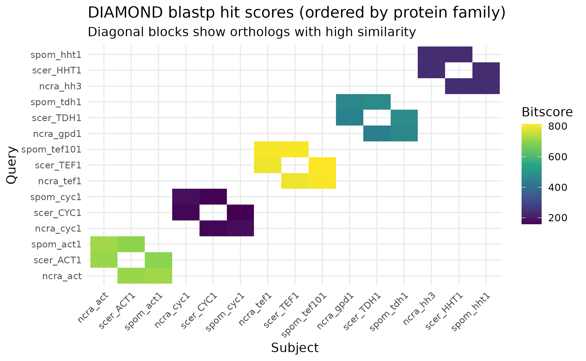
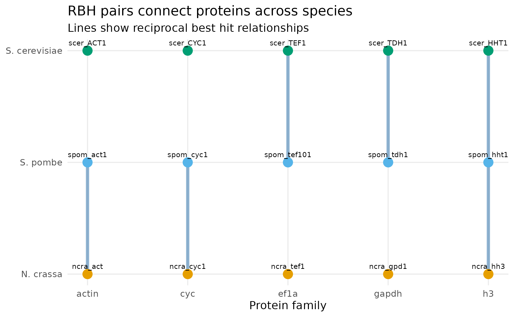
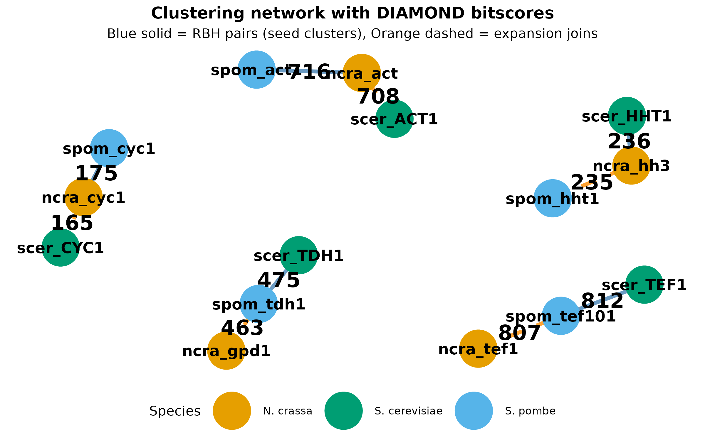
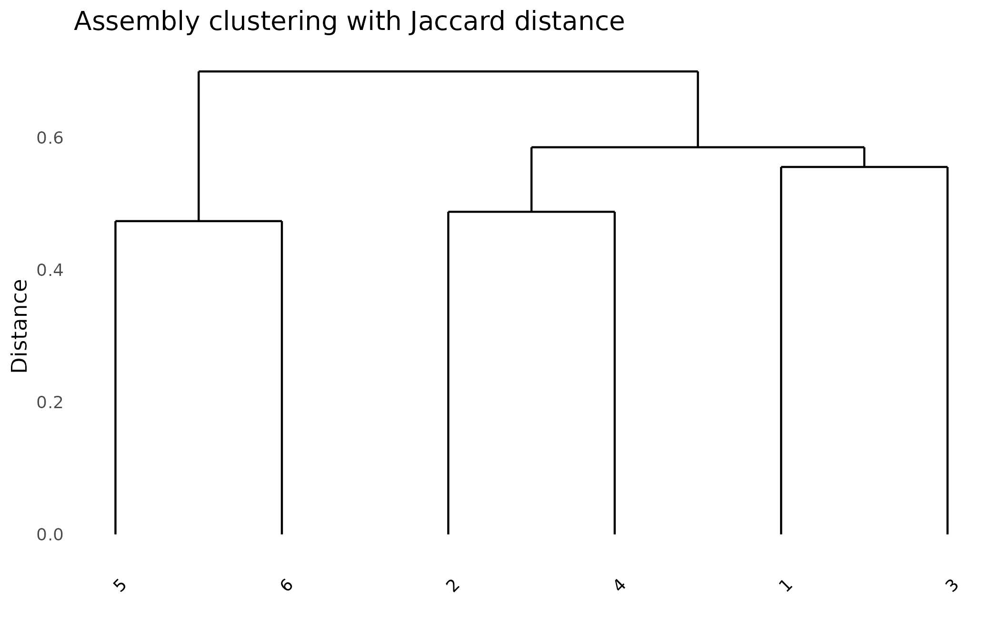

# Algorithms in paneffectR

## Introduction

This vignette walks through the DIAMOND RBH + Expansion clustering
algorithm step by step, using real data from known fungal orthologs.
Instead of describing algorithms conceptually, we show exactly what
happens at each stage with actual sequence data.

``` r
library(paneffectR)
library(dplyr)
library(tidyr)
library(ggplot2)
```

## The Dataset

We use 16 well-characterized proteins from three fungal species with
known orthology relationships:

``` r
# Load the protein collection
clustering_dir <- system.file("testdata", "clustering", package = "paneffectR")
proteins <- readRDS(file.path(clustering_dir, "known_orthologs.rds"))

# Load expected relationships (ground truth)
expected <- read.csv(file.path(clustering_dir, "expected_orthogroups.csv"))

# Summary
proteins
#> -- protein_collection --
#> 3 assemblies, 16 total proteins
#> 
#> # A tibble: 3 × 3
#>   assembly_name n_proteins has_scores
#>   <chr>              <int> <lgl>     
#> 1 ncra                   5 FALSE     
#> 2 scer                   6 FALSE     
#> 3 spom                   5 FALSE
```

The dataset includes:

- **3 species**: *S. cerevisiae* (budding yeast), *S. pombe* (fission
  yeast), *N. crassa* (bread mold)
- **5 conserved protein families**: actin, GAPDH, histone H3, EF-1α,
  cytochrome c
- **1 species-specific singleton**: mating pheromone MFA1 (only in S.
  cerevisiae)

``` r
expected |>
  select(protein_id, assembly, expected_og, protein_name) |>
  knitr::kable(caption = "Ground truth: expected orthogroup assignments")
```

| protein_id  | assembly | expected_og   | protein_name                               |
|:------------|:---------|:--------------|:-------------------------------------------|
| scer_ACT1   | scer     | OG_actin      | Actin                                      |
| spom_act1   | spom     | OG_actin      | Actin                                      |
| ncra_act    | ncra     | OG_actin      | Actin                                      |
| scer_TDH1   | scer     | OG_gapdh      | Glyceraldehyde-3-phosphate dehydrogenase 1 |
| spom_tdh1   | spom     | OG_gapdh      | Glyceraldehyde-3-phosphate dehydrogenase 1 |
| ncra_gpd1   | ncra     | OG_gapdh      | Glyceraldehyde-3-phosphate dehydrogenase   |
| scer_HHT1   | scer     | OG_histone_h3 | Histone H3                                 |
| spom_hht1   | spom     | OG_histone_h3 | Histone H3.1/H3.2                          |
| ncra_hh3    | ncra     | OG_histone_h3 | Histone H3                                 |
| scer_TEF1   | scer     | OG_ef1a       | Elongation factor 1-alpha                  |
| spom_tef101 | spom     | OG_ef1a       | Elongation factor 1-alpha-A                |
| ncra_tef1   | ncra     | OG_ef1a       | Elongation factor 1-alpha                  |
| scer_CYC1   | scer     | OG_cyc        | Cytochrome c isoform 1                     |
| spom_cyc1   | spom     | OG_cyc        | Cytochrome c                               |
| ncra_cyc1   | ncra     | OG_cyc        | Cytochrome c                               |
| scer_MFA1   | scer     | singleton     | Mating factor alpha-1                      |

Ground truth: expected orthogroup assignments

## Step 1: All-vs-All Alignment

The first step runs DIAMOND blastp to compare every protein against
every other protein. This produces a table of sequence similarity hits.

paneffectR runs DIAMOND with a custom output format to get the columns
needed for filtering and RBH detection:

``` bash
diamond blastp -d db -q proteins.faa -o hits.tsv \
  --outfmt 6 qseqid sseqid pident length qlen evalue bitscore
```

``` r
# Load pre-computed DIAMOND results
diamond_hits <- readRDS(file.path(clustering_dir, "diamond_hits.rds"))

# Show structure
cat("Total hits (excluding self-hits):", nrow(diamond_hits), "\n\n")
#> Total hits (excluding self-hits): 30
head(diamond_hits, 10) |>
  knitr::kable(digits = 2, caption = "DIAMOND output with computed coverage")
```

| qseqid    | sseqid      | pident | length | qlen | evalue | bitscore |   qcov |
|:----------|:------------|-------:|-------:|-----:|-------:|---------:|-------:|
| ncra_act  | spom_act1   |   92.0 |    375 |  375 |      0 |      716 | 100.00 |
| ncra_act  | scer_ACT1   |   92.0 |    375 |  375 |      0 |      709 | 100.00 |
| ncra_gpd1 | spom_tdh1   |   69.1 |    333 |  338 |      0 |      463 |  98.52 |
| ncra_gpd1 | scer_TDH1   |   63.7 |    331 |  338 |      0 |      438 |  97.93 |
| ncra_hh3  | scer_HHT1   |   94.9 |    136 |  136 |      0 |      236 | 100.00 |
| ncra_hh3  | spom_hht1   |   92.6 |    136 |  136 |      0 |      235 | 100.00 |
| ncra_tef1 | spom_tef101 |   86.1 |    460 |  460 |      0 |      807 | 100.00 |
| ncra_tef1 | scer_TEF1   |   85.7 |    460 |  460 |      0 |      795 | 100.00 |
| ncra_cyc1 | spom_cyc1   |   70.4 |    108 |  108 |      0 |      175 | 100.00 |
| ncra_cyc1 | scer_CYC1   |   69.2 |    104 |  108 |      0 |      166 |  96.30 |

DIAMOND output with computed coverage

### Understanding the columns

**From DIAMOND directly** (7 columns):

| Column     | Description                                        |
|------------|----------------------------------------------------|
| `qseqid`   | Query protein ID                                   |
| `sseqid`   | Subject (hit) protein ID                           |
| `pident`   | Percent sequence identity                          |
| `length`   | Alignment length (amino acids)                     |
| `qlen`     | Query sequence length                              |
| `evalue`   | E-value (statistical significance; lower = better) |
| `bitscore` | Bit score (higher = better match)                  |

**Computed by paneffectR** (1 column):

| Column | Formula                 | Purpose                                       |
|--------|-------------------------|-----------------------------------------------|
| `qcov` | `(length / qlen) * 100` | Query coverage percentage, used for filtering |

Note: This differs from the default BLAST tabular format, which includes
alignment coordinates (`qstart`, `qend`, `sstart`, `send`) and gap
information (`mismatch`, `gapopen`). We request only the columns needed
for clustering.

### Visualizing hit scores

``` r
# Get best hit between each pair
best_hits <- diamond_hits |>
  group_by(qseqid, sseqid) |>
  slice_max(bitscore, n = 1) |>
  ungroup()

# Order proteins by protein family (expected_og) to reveal ortholog blocks
protein_order <- expected |>
  arrange(expected_og, assembly) |>
  pull(protein_id)

# Convert to long format for ggplot with family-based ordering
plot_data <- best_hits |>
  mutate(
    qseqid = factor(qseqid, levels = protein_order),
    sseqid = factor(sseqid, levels = protein_order)
  )

ggplot(plot_data, aes(x = sseqid, y = qseqid, fill = bitscore)) +
  geom_tile() +
  scale_fill_viridis_c(name = "Bitscore") +

  theme_minimal() +
  theme(axis.text.x = element_text(angle = 45, hjust = 1, size = 8),
        axis.text.y = element_text(size = 8)) +
  labs(x = "Subject", y = "Query",
       title = "DIAMOND blastp hit scores (ordered by protein family)",
       subtitle = "Diagonal blocks show orthologs with high similarity")
```



The heatmap reveals clear ortholog groups: proteins from the same family
(e.g., all three actins) cluster together with high scores, while
unrelated proteins show no hits.

**Note:** The singleton `scer_MFA1` (mating pheromone) is absent from
this plot because it has no significant hits to any other protein -
exactly why it will end up as a singleton in the final clustering.

## Step 2: Filtering by Thresholds

Not all hits are meaningful. We apply thresholds to keep only
significant matches:

| Parameter      | Default | Purpose                                     |
|----------------|---------|---------------------------------------------|
| `min_identity` | 30%     | Exclude very divergent matches              |
| `min_coverage` | 50%     | Exclude partial matches                     |
| `evalue`       | 1e-5    | Exclude statistically insignificant matches |

``` r
# Load filtered hits
hits_filtered <- readRDS(file.path(clustering_dir, "diamond_hits_filtered.rds"))

cat("Before filtering:", nrow(diamond_hits), "hits\n")
#> Before filtering: 30 hits
cat("After filtering: ", nrow(hits_filtered), "hits\n")
#> After filtering:  30 hits
```

In this case, all hits pass the filters because these are well-conserved
proteins with high sequence similarity.

## Step 3: Finding Reciprocal Best Hits

A **reciprocal best hit (RBH)** is when two proteins are each other’s
best match. This is a stringent criterion for orthology:

1.  Find protein A’s best hit → B
2.  Find protein B’s best hit → back to A?
3.  If yes, A and B are reciprocal best hits

From our 30 filtered hits, paneffectR identified 5 RBH pairs:

``` r
rbh_pairs <- readRDS(file.path(clustering_dir, "rbh_pairs.rds"))

rbh_pairs |>
  knitr::kable(caption = "Reciprocal best hit pairs identified")
```

| protein_a | protein_b   |
|:----------|:------------|
| ncra_act  | spom_act1   |
| ncra_cyc1 | spom_cyc1   |
| ncra_hh3  | scer_HHT1   |
| scer_TDH1 | spom_tdh1   |
| scer_TEF1 | spom_tef101 |

Reciprocal best hit pairs identified

### Why not all orthologs form RBH pairs

Let’s trace through an example where RBH **fails** to connect obvious
orthologs.

**Question:** Is `scer_ACT1` (yeast actin) in an RBH pair with
`ncra_act` (N. crassa actin)?

**Step 1:** Find `scer_ACT1`’s best hit.

``` r
scer_act1_hits <- hits_filtered |>
  filter(qseqid == "scer_ACT1") |>
  arrange(desc(bitscore))

scer_act1_hits |>
  select(qseqid, sseqid, pident, bitscore) |>
  knitr::kable()
```

| qseqid    | sseqid    | pident | bitscore |
|:----------|:----------|-------:|---------:|
| scer_ACT1 | ncra_act  |   92.0 |      708 |
| scer_ACT1 | spom_act1 |   89.6 |      696 |

The best hit (highest bitscore) is `ncra_act` with score 708.

**Step 2:** Check the reverse - what is `ncra_act`’s best hit?

``` r
ncra_act_hits <- hits_filtered |>
  filter(qseqid == "ncra_act") |>
  arrange(desc(bitscore))

ncra_act_hits |>
  select(qseqid, sseqid, pident, bitscore) |>
  knitr::kable()
```

| qseqid   | sseqid    | pident | bitscore |
|:---------|:----------|-------:|---------:|
| ncra_act | spom_act1 |     92 |      716 |
| ncra_act | scer_ACT1 |     92 |      709 |

The best hit for `ncra_act` is `spom_act1` (score 716), **not**
`scer_ACT1` (score 709).

**Result:** `scer_ACT1` → `ncra_act`, but `ncra_act` → `spom_act1`. The
relationship is not reciprocal, so they are **not** an RBH pair.

This illustrates the limitation of pure RBH: `scer_ACT1` is a clear
actin ortholog, but because `ncra_act` is slightly more similar to
`spom_act1`, the yeast actin gets left out of the RBH network. The
expansion phase (Step 5) will rescue it.

### Visualizing RBH pairs

With only 5 RBH pairs from 15 orthologous proteins, we’re clearly
missing connections. To see the pattern, let’s visualize which species
are linked by RBH for each protein family.

The figure below shows all 5 RBH pairs as lines connecting proteins
across species. Each column is a protein family, each row is a species.
Notice that RBH pairs only connect **two species at a time** - this is
the fundamental limitation that the expansion phase addresses.

``` r
# Get protein positions for network layout
protein_positions <- expected |>
  filter(expected_og != "singleton") |>
  mutate(
    x = as.numeric(factor(expected_og)),
    y = as.numeric(factor(assembly, levels = c("ncra", "spom", "scer")))
  )

# Plot
ggplot() +
  # Add edges for RBH pairs
  geom_segment(
    data = rbh_pairs |>
      left_join(protein_positions |> select(protein_id, x, y),
                by = c("protein_a" = "protein_id")) |>
      rename(x1 = x, y1 = y) |>
      left_join(protein_positions |> select(protein_id, x, y),
                by = c("protein_b" = "protein_id")) |>
      rename(x2 = x, y2 = y),
    aes(x = x1, y = y1, xend = x2, yend = y2),
    color = "steelblue", linewidth = 1.5, alpha = 0.6
  ) +
  # Add protein points
  geom_point(data = protein_positions,
             aes(x = x, y = y, color = assembly),
             size = 4) +
  geom_text(data = protein_positions,
            aes(x = x, y = y, label = protein_id),
            size = 2.5, vjust = -1) +
  scale_y_continuous(
    breaks = 1:3,
    labels = c("N. crassa", "S. pombe", "S. cerevisiae")
  ) +
  scale_x_continuous(
    breaks = 1:5,
    labels = c("actin", "cyc", "ef1a", "gapdh", "h3")
  ) +
  scale_color_manual(values = c(ncra = "#E69F00", spom = "#56B4E9", scer = "#009E73")) +
  theme_minimal() +
  labs(title = "RBH pairs connect proteins across species",
       subtitle = "Lines show reciprocal best hit relationships",
       x = "Protein family", y = NULL) +
  theme(legend.position = "none",
        panel.grid.minor = element_blank())
```



Notice that RBH pairs only connect **two species at a time**. This is
the fundamental limitation of pure RBH: it can’t directly identify
orthogroups spanning three or more species.

## Step 4: Building Seed Clusters

The RBH pairs form the “seeds” for orthogroups. We find **connected
components** in the RBH graph: proteins linked through any chain of RBH
pairs form one group.

``` r
orthogroups_seed <- readRDS(file.path(clustering_dir, "orthogroups_seed.rds"))

orthogroups_seed |>
  arrange(orthogroup_id, protein_id) |>
  knitr::kable(caption = "Seed orthogroups from RBH connected components")
```

| orthogroup_id | protein_id  |
|:--------------|:------------|
| OG0001        | ncra_act    |
| OG0001        | spom_act1   |
| OG0002        | ncra_cyc1   |
| OG0002        | spom_cyc1   |
| OG0003        | ncra_hh3    |
| OG0003        | scer_HHT1   |
| OG0004        | scer_TDH1   |
| OG0004        | spom_tdh1   |
| OG0005        | scer_TEF1   |
| OG0005        | spom_tef101 |

Seed orthogroups from RBH connected components

After the seed phase:

- **5 orthogroups** with 10 proteins (2 proteins each)
- **6 singletons**: proteins not in any RBH pair

``` r
seed_summary <- orthogroups_seed |>
  group_by(orthogroup_id) |>
  summarize(n_proteins = n(), proteins = paste(protein_id, collapse = ", "))

seed_summary |>
  knitr::kable(caption = "Seed orthogroup composition")
```

| orthogroup_id | n_proteins | proteins               |
|:--------------|-----------:|:-----------------------|
| OG0001        |          2 | ncra_act, spom_act1    |
| OG0002        |          2 | ncra_cyc1, spom_cyc1   |
| OG0003        |          2 | ncra_hh3, scer_HHT1    |
| OG0004        |          2 | scer_TDH1, spom_tdh1   |
| OG0005        |          2 | scer_TEF1, spom_tef101 |

Seed orthogroup composition

``` r

# List singletons
all_proteins_list <- unlist(lapply(proteins$assemblies, function(ps) ps$proteins$protein_id))
singletons <- setdiff(all_proteins_list, orthogroups_seed$protein_id)
cat("\nSingletons after seed phase:", paste(singletons, collapse = ", "), "\n")
#> 
#> Singletons after seed phase: ncra_gpd1, ncra_tef1, scer_ACT1, scer_CYC1, scer_MFA1, spom_hht1
```

The actins (`scer_ACT1`), GAPDH (`ncra_gpd1`), cytochrome c
(`scer_CYC1`), EF-1α (`ncra_tef1`), and histone H3 (`spom_hht1`) are all
singletons - they weren’t part of any RBH pair even though they have
clear orthologs!

## Step 5: Expansion Phase

The expansion phase addresses the RBH limitation by adding singletons to
existing orthogroups when their best hit is already a cluster member:

1.  For each singleton, find its best hit
2.  If that hit is in an orthogroup, add the singleton to that group
3.  Repeat until no more proteins can be added

### The DIAMOND hits behind RBH pairs

First, let’s see the actual DIAMOND output rows that support the 5 RBH
pairs. For each RBH pair, both directions must be best hits:

``` r
# Get the DIAMOND hits that form RBH pairs
# For each RBH pair, show both directions from the original DIAMOND output
rbh_evidence <- rbh_pairs |>
  rowwise() |>
  mutate(
    # Get hit A -> B
    hit_ab = list(hits_filtered |>
      filter(qseqid == protein_a, sseqid == protein_b) |>
      select(qseqid, sseqid, pident, bitscore)),
    # Get hit B -> A
    hit_ba = list(hits_filtered |>
      filter(qseqid == protein_b, sseqid == protein_a) |>
      select(qseqid, sseqid, pident, bitscore))
  ) |>
  ungroup()

# Combine into one table
rbh_hits <- bind_rows(
  bind_rows(rbh_evidence$hit_ab),
  bind_rows(rbh_evidence$hit_ba)
) |>
  arrange(qseqid, desc(bitscore))

rbh_hits |>
  knitr::kable(
    caption = "DIAMOND hits for RBH pairs (both directions)",
    col.names = c("Query", "Subject", "% Identity", "Bitscore"),
    digits = 1
  )
```

| Query       | Subject     | % Identity | Bitscore |
|:------------|:------------|-----------:|---------:|
| ncra_act    | spom_act1   |       92.0 |      716 |
| ncra_cyc1   | spom_cyc1   |       70.4 |      175 |
| ncra_hh3    | scer_HHT1   |       94.9 |      236 |
| scer_HHT1   | ncra_hh3    |       94.9 |      235 |
| scer_TDH1   | spom_tdh1   |       70.7 |      475 |
| scer_TEF1   | spom_tef101 |       87.1 |      812 |
| spom_act1   | ncra_act    |       92.0 |      716 |
| spom_cyc1   | ncra_cyc1   |       70.4 |      177 |
| spom_tdh1   | scer_TDH1   |       70.7 |      470 |
| spom_tef101 | scer_TEF1   |       86.7 |      808 |

DIAMOND hits for RBH pairs (both directions)

Each protein in an RBH pair has the other as its top hit (highest
bitscore).

### The DIAMOND hits behind expansion

Now let’s see the DIAMOND evidence for expansion. Each singleton’s best
hit must be in an existing cluster:

``` r
expansion_trace <- readRDS(file.path(clustering_dir, "expansion_trace.rds"))

# For each singleton, show its DIAMOND hits (best hit first)
singletons_list <- expansion_trace$singleton

singleton_hits <- hits_filtered |>
  filter(qseqid %in% singletons_list) |>
  group_by(qseqid) |>
  arrange(desc(bitscore)) |>
  slice_head(n = 2) |>  # Show top 2 hits for context
  ungroup() |>
  select(qseqid, sseqid, pident, bitscore)

# Add cluster membership info
clustered_proteins <- orthogroups_seed$protein_id
singleton_hits <- singleton_hits |>
  mutate(
    hit_in_cluster = ifelse(sseqid %in% clustered_proteins, "Yes", "No")
  )

singleton_hits |>
  knitr::kable(
    caption = "DIAMOND hits from singletons (top 2 per singleton)",
    col.names = c("Singleton", "Hit", "% Identity", "Bitscore", "Hit in cluster?"),
    digits = 1
  )
```

| Singleton | Hit         | % Identity | Bitscore | Hit in cluster? |
|:----------|:------------|-----------:|---------:|:----------------|
| ncra_gpd1 | spom_tdh1   |       69.1 |      463 | Yes             |
| ncra_gpd1 | scer_TDH1   |       63.7 |      438 | Yes             |
| ncra_tef1 | spom_tef101 |       86.1 |      807 | Yes             |
| ncra_tef1 | scer_TEF1   |       85.7 |      795 | Yes             |
| scer_ACT1 | ncra_act    |       92.0 |      708 | Yes             |
| scer_ACT1 | spom_act1   |       89.6 |      696 | Yes             |
| scer_CYC1 | ncra_cyc1   |       69.2 |      165 | Yes             |
| scer_CYC1 | spom_cyc1   |       70.2 |      159 | Yes             |
| spom_hht1 | ncra_hh3    |       92.6 |      235 | Yes             |
| spom_hht1 | scer_HHT1   |       92.6 |      232 | Yes             |

DIAMOND hits from singletons (top 2 per singleton)

For each singleton, the best hit (highest bitscore) is already in a seed
cluster, so the singleton joins that cluster.

``` r
# Summarize the joins
expansion_trace |>
  select(singleton, best_hit, best_hit_bitscore, target_cluster) |>
  knitr::kable(
    caption = "Expansion decisions: singleton joins cluster via best hit",
    col.names = c("Singleton", "Best hit", "Bitscore", "Joins cluster"),
    digits = 0
  )
```

| Singleton | Best hit    | Bitscore | Joins cluster |
|:----------|:------------|---------:|:--------------|
| ncra_gpd1 | spom_tdh1   |      463 | OG0004        |
| ncra_tef1 | spom_tef101 |      807 | OG0005        |
| scer_ACT1 | ncra_act    |      708 | OG0001        |
| scer_CYC1 | ncra_cyc1   |      165 | OG0002        |
| spom_hht1 | ncra_hh3    |      235 | OG0003        |

Expansion decisions: singleton joins cluster via best hit

### Visualizing the clustering network

The network below shows how DIAMOND scores connect proteins. Edge
thickness and labels show bitscores from the DIAMOND output. Blue edges
are RBH pairs (seeds); orange edges show expansion connections.

``` r
library(igraph)

# Build edges from RBH pairs with their DIAMOND scores
rbh_with_scores <- rbh_pairs |>
  left_join(
    hits_filtered |> select(qseqid, sseqid, bitscore),
    by = c("protein_a" = "qseqid", "protein_b" = "sseqid")
  ) |>
  left_join(
    hits_filtered |> select(qseqid, sseqid, bitscore),
    by = c("protein_a" = "sseqid", "protein_b" = "qseqid"),
    suffix = c("", "_rev")
  ) |>
  mutate(bitscore = coalesce(bitscore, bitscore_rev)) |>
  select(from = protein_a, to = protein_b, bitscore) |>
  mutate(type = "RBH (seed)")

# Expansion edges already have scores
expansion_with_scores <- expansion_trace |>
  select(from = singleton, to = best_hit, bitscore = best_hit_bitscore) |>
  mutate(type = "Expansion")

# Combine all edges
all_edges <- bind_rows(rbh_with_scores, expansion_with_scores)

# Get node info (exclude singleton MFA1 which has no edges)
nodes <- expected |>
  filter(expected_og != "singleton") |>
  select(protein_id, assembly, expected_og)

# Create igraph object
g <- graph_from_data_frame(all_edges, directed = FALSE, vertices = nodes)

# Use Fruchterman-Reingold layout for natural clustering
set.seed(42)
layout <- layout_with_fr(g)
# Scale up to increase distance between nodes
layout <- layout * 2
layout_df <- as.data.frame(layout)
names(layout_df) <- c("x", "y")
layout_df$protein_id <- V(g)$name

# Add node attributes
layout_df <- layout_df |>
  left_join(nodes, by = "protein_id")

# Prepare edge coordinates
edge_df <- all_edges |>
  left_join(layout_df |> select(protein_id, x, y), by = c("from" = "protein_id")) |>
  rename(x1 = x, y1 = y) |>
  left_join(layout_df |> select(protein_id, x, y), by = c("to" = "protein_id")) |>
  rename(x2 = x, y2 = y) |>
  mutate(
    xmid = (x1 + x2) / 2,
    ymid = (y1 + y2) / 2,
    score_label = round(bitscore)
  )

# Plot
ggplot() +
  # RBH edges (solid, fixed width)
  geom_segment(
    data = filter(edge_df, type == "RBH (seed)"),
    aes(x = x1, y = y1, xend = x2, yend = y2),
    color = "steelblue", linewidth = 1.5, alpha = 0.8
  ) +
  # Expansion edges (dashed, fixed width)
  geom_segment(
    data = filter(edge_df, type == "Expansion"),
    aes(x = x1, y = y1, xend = x2, yend = y2),
    color = "darkorange", linewidth = 1.5, linetype = "dashed", alpha = 0.8
  ) +
  # Protein nodes (large)
  geom_point(
    data = layout_df,
    aes(x = x, y = y, color = assembly),
    size = 14
  ) +
  # Protein labels (inside nodes)
  geom_text(
    data = layout_df,
    aes(x = x, y = y, label = protein_id),
    size = 4.4, fontface = "bold", color = "black"
  ) +
  # Edge score labels
  geom_text(
    data = edge_df,
    aes(x = xmid, y = ymid, label = score_label),
    size = 6, fontface = "bold"
  ) +
  scale_color_manual(
    values = c(ncra = "#E69F00", spom = "#56B4E9", scer = "#009E73"),
    labels = c(ncra = "N. crassa", spom = "S. pombe", scer = "S. cerevisiae")
  ) +
  coord_cartesian(clip = "off") +
  expand_limits(x = c(min(layout_df$x) - 0.5, max(layout_df$x) + 0.5),
                y = c(min(layout_df$y) - 0.5, max(layout_df$y) + 0.5)) +
  theme_void() +
  labs(
    title = "Clustering network with DIAMOND bitscores",
    subtitle = "Blue solid = RBH pairs (seed clusters), Orange dashed = expansion joins",
    color = "Species"
  ) +
  theme(
    legend.position = "bottom",
    plot.title = element_text(hjust = 0.5, face = "bold"),
    plot.subtitle = element_text(hjust = 0.5)
  )
```



The network naturally clusters into 5 groups (the orthogroups). Proteins
with high DIAMOND scores are pulled together. Notice how each orthogroup
has 3 members connected by a mix of RBH (seed) and expansion edges.

### What happened in expansion

Take `scer_ACT1` as an example:

- It’s not in an RBH pair (its best hit `ncra_act` prefers `spom_act1`)
- But `ncra_act` IS in OG0001 (via RBH with `spom_act1`)
- So `scer_ACT1` joins OG0001 through its best-hit connection

This “anchor and expand” strategy lets orthogroups grow beyond strict
RBH pairs while maintaining the high-confidence RBH relationships as a
foundation.

In iteration 1, all 5 “missing” orthologs found their way home:

``` r
# Show before and after with expected orthogroup names
orthogroups_expanded <- readRDS(file.path(clustering_dir, "orthogroups_expanded.rds"))

# Add expected orthogroup info
protein_info <- expected |>
  select(protein_id, expected_og)

cat("=== Before Expansion (Seed Phase) ===\n")
#> === Before Expansion (Seed Phase) ===
orthogroups_seed |>
  left_join(protein_info, by = "protein_id") |>
  group_by(orthogroup_id) |>
  summarize(
    protein_family = first(expected_og),
    members = paste(sort(protein_id), collapse = ", ")
  ) |>
  knitr::kable()
```

| orthogroup_id | protein_family | members                |
|:--------------|:---------------|:-----------------------|
| OG0001        | OG_actin       | ncra_act, spom_act1    |
| OG0002        | OG_cyc         | ncra_cyc1, spom_cyc1   |
| OG0003        | OG_histone_h3  | ncra_hh3, scer_HHT1    |
| OG0004        | OG_gapdh       | scer_TDH1, spom_tdh1   |
| OG0005        | OG_ef1a        | scer_TEF1, spom_tef101 |

``` r

cat("\n=== After Expansion ===\n")
#> 
#> === After Expansion ===
orthogroups_expanded |>
  left_join(protein_info, by = "protein_id") |>
  group_by(orthogroup_id) |>
  summarize(
    protein_family = first(expected_og),
    members = paste(sort(protein_id), collapse = ", "),
    n = n()
  ) |>
  knitr::kable()
```

| orthogroup_id | protein_family | members                           |   n |
|:--------------|:---------------|:----------------------------------|----:|
| OG0001        | OG_actin       | ncra_act, scer_ACT1, spom_act1    |   3 |
| OG0002        | OG_cyc         | ncra_cyc1, scer_CYC1, spom_cyc1   |   3 |
| OG0003        | OG_histone_h3  | ncra_hh3, scer_HHT1, spom_hht1    |   3 |
| OG0004        | OG_gapdh       | ncra_gpd1, scer_TDH1, spom_tdh1   |   3 |
| OG0005        | OG_ef1a        | ncra_tef1, scer_TEF1, spom_tef101 |   3 |

``` r

# Check singleton
final_singletons <- setdiff(all_proteins_list, orthogroups_expanded$protein_id)
cat("\nFinal singleton:", final_singletons, "\n")
#> 
#> Final singleton: scer_MFA1
```

All 5 protein families now have their complete set of 3 orthologs, and
`scer_MFA1` correctly remains a singleton.

## Effect of Parameters

What happens with stricter thresholds? Let’s compare:

``` r
# Load strict parameter results
hits_strict <- readRDS(file.path(clustering_dir, "diamond_hits_strict.rds"))
orthogroups_strict <- readRDS(file.path(clustering_dir, "orthogroups_strict.rds"))

cat("Default parameters (min_identity = 30%):\n")
#> Default parameters (min_identity = 30%):
cat("  Hits passing filter:", nrow(hits_filtered), "\n")
#>   Hits passing filter: 30
cat("  Orthogroups:", length(unique(orthogroups_expanded$orthogroup_id)), "\n")
#>   Orthogroups: 5
cat("  Proteins in orthogroups:", nrow(orthogroups_expanded), "\n")
#>   Proteins in orthogroups: 15

cat("\nStrict parameters (min_identity = 70%):\n")
#> 
#> Strict parameters (min_identity = 70%):
cat("  Hits passing filter:", nrow(hits_strict), "\n")
#>   Hits passing filter: 24
cat("  Orthogroups:", length(unique(orthogroups_strict$orthogroup_id)), "\n")
#>   Orthogroups: 5
cat("  Proteins in orthogroups:", nrow(orthogroups_strict), "\n")
#>   Proteins in orthogroups: 14
```

### Which proteins are affected?

``` r
# Find proteins that got excluded
proteins_strict <- orthogroups_strict$protein_id
proteins_default <- orthogroups_expanded$protein_id

newly_singletons <- setdiff(proteins_default, proteins_strict)

cat("Proteins excluded by strict parameters:\n")
#> Proteins excluded by strict parameters:
expected |>
  filter(protein_id %in% newly_singletons) |>
  select(protein_id, protein_name, expected_og) |>
  knitr::kable()
```

| protein_id | protein_name                             | expected_og |
|:-----------|:-----------------------------------------|:------------|
| ncra_gpd1  | Glyceraldehyde-3-phosphate dehydrogenase | OG_gapdh    |

``` r

# Show the excluded hits
hits_filtered |>
  filter(!qseqid %in% proteins_strict | !sseqid %in% proteins_strict) |>
  filter(qseqid %in% newly_singletons | sseqid %in% newly_singletons) |>
  select(qseqid, sseqid, pident, bitscore) |>
  distinct() |>
  knitr::kable(caption = "Hits excluded by 70% identity threshold")
```

| qseqid    | sseqid    | pident | bitscore |
|:----------|:----------|-------:|---------:|
| ncra_gpd1 | spom_tdh1 |   69.1 |      463 |
| ncra_gpd1 | scer_TDH1 |   63.7 |      438 |
| scer_TDH1 | ncra_gpd1 |   63.7 |      441 |
| spom_tdh1 | ncra_gpd1 |   69.1 |      461 |

Hits excluded by 70% identity threshold

The GAPDH and cytochrome c families have cross-species identities around
63-69%, below the strict 70% threshold. These proteins become
incorrectly isolated as singletons with overly strict parameters.

## Distance Metrics

Once orthogroups are assigned, we can build a presence/absence matrix
(rows = orthogroups, columns = assemblies). To compare how similar two
assemblies are based on their shared orthogroup content, we need a
distance metric. This is used for hierarchical clustering and
visualizations like dendrograms.

### Jaccard Distance (Recommended)

The [Jaccard index](https://en.wikipedia.org/wiki/Jaccard_index)
measures similarity as the size of the intersection divided by the size
of the union. The distance is 1 minus this similarity, ignoring shared
absences: $$d_{Jaccard}(A,B) = 1 - \frac{|A \cap B|}{|A \cup B|}$$

``` r
# Load example data from visual testdata
visual_dir <- system.file("testdata", "visual", package = "paneffectR")
pa <- readRDS(file.path(visual_dir, "pa_binary.rds"))

plot_dendro(pa, distance_method = "jaccard") +
  ggtitle("Assembly clustering with Jaccard distance")
```



### Other distance options

**Binary (Euclidean)**: Square root of the number of orthogroups where
two assemblies differ.

**Bray-Curtis**: Originally designed for abundance data, but works with
binary. See
[Wikipedia](https://en.wikipedia.org/wiki/Bray%E2%80%93Curtis_dissimilarity).

| Method    | Best for                                            |
|-----------|-----------------------------------------------------|
| `jaccard` | Presence/absence data (default)                     |
| `binary`  | When total differences matter more than proportions |
| `bray`    | Abundance or score data                             |

## Hierarchical Clustering Methods

After computing distances, assemblies are clustered hierarchically:

| Method     | Behavior                                            |
|------------|-----------------------------------------------------|
| `complete` | Conservative - maximizes distances between clusters |
| `average`  | Balanced - common in phylogenetics                  |
| `ward.D2`  | Creates distinct, equal-sized clusters              |

``` r
# Compare methods
plot_dendro(pa, cluster_method = "complete")
plot_dendro(pa, cluster_method = "average")
plot_dendro(pa, cluster_method = "ward.D2")
```

## Handling Singletons

Singletons are proteins not assigned to any orthogroup. They may
represent:

1.  **True unique genes**: Horizontally transferred, species-specific
2.  **Divergent homologs**: Too different to pass similarity thresholds
3.  **Artifacts**: Mis-predicted ORFs, fragmented assemblies

``` r
# Using the visual test data
visual_dir <- system.file("testdata", "visual", package = "paneffectR")
clusters <- readRDS(file.path(visual_dir, "clusters_visual.rds"))

# Compare with and without singletons
pa_with <- build_pa_matrix(clusters, exclude_singletons = FALSE)
pa_without <- build_pa_matrix(clusters, exclude_singletons = TRUE)

cat("With singletons:", nrow(pa_with$matrix), "orthogroups\n")
#> With singletons: 62 orthogroups
cat("Without singletons:", nrow(pa_without$matrix), "orthogroups\n")
#> Without singletons: 50 orthogroups
```

**When to include singletons:** - Analyzing unique gene content -
Calculating pan-genome size - Studying accessory genome

**When to exclude singletons:** - Focusing on shared variation -
Phylogenetic analysis - Reducing noise

## Future Additions

The
[`cluster_proteins()`](https://TeamMacLean.github.io/paneffectR/reference/cluster_proteins.md)
function is designed to support multiple clustering backends. Currently
only DIAMOND RBH is implemented, but the interface accepts a `method`
parameter for future expansion:

``` r
cluster_proteins(proteins, method = "diamond_rbh")  # Current default
cluster_proteins(proteins, method = "orthofinder")  # Planned
cluster_proteins(proteins, method = "mmseqs2")      # Planned
```

### OrthoFinder

[OrthoFinder](https://github.com/davidemms/OrthoFinder) infers
orthogroups using gene trees and is considered a gold standard for
orthology inference. It handles paralogs more rigorously than RBH-based
methods but requires more computation time.

### MMseqs2

[MMseqs2](https://github.com/soedinglab/MMseqs2) provides ultra-fast
protein clustering suitable for very large datasets. Its greedy
clustering approach trades some sensitivity for speed, making it useful
when analysing hundreds of assemblies.
