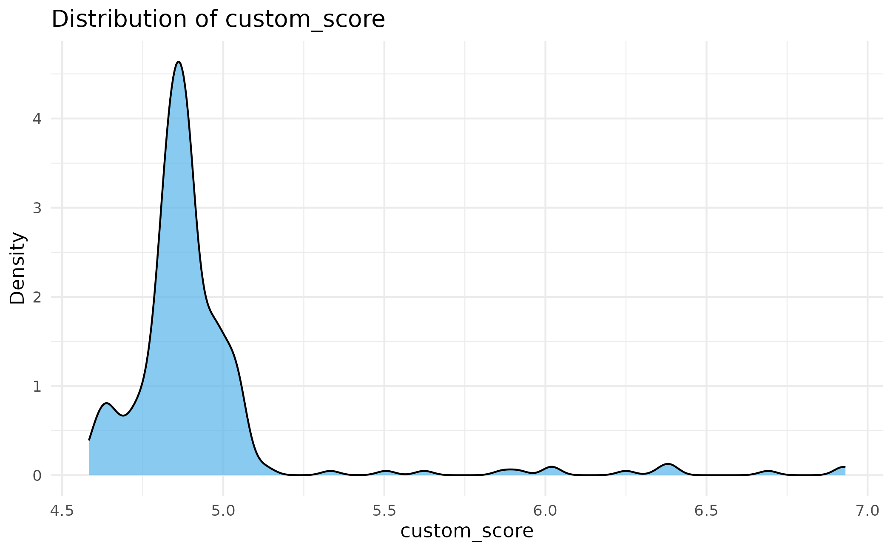
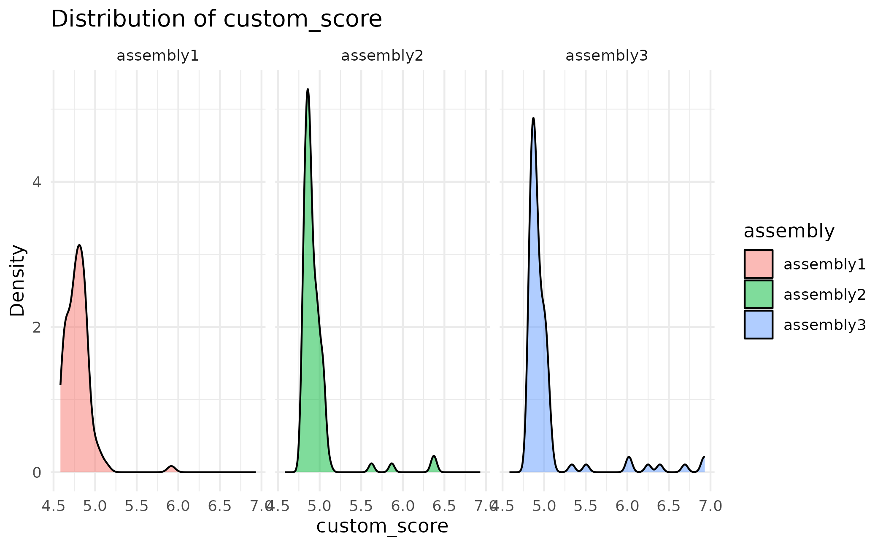
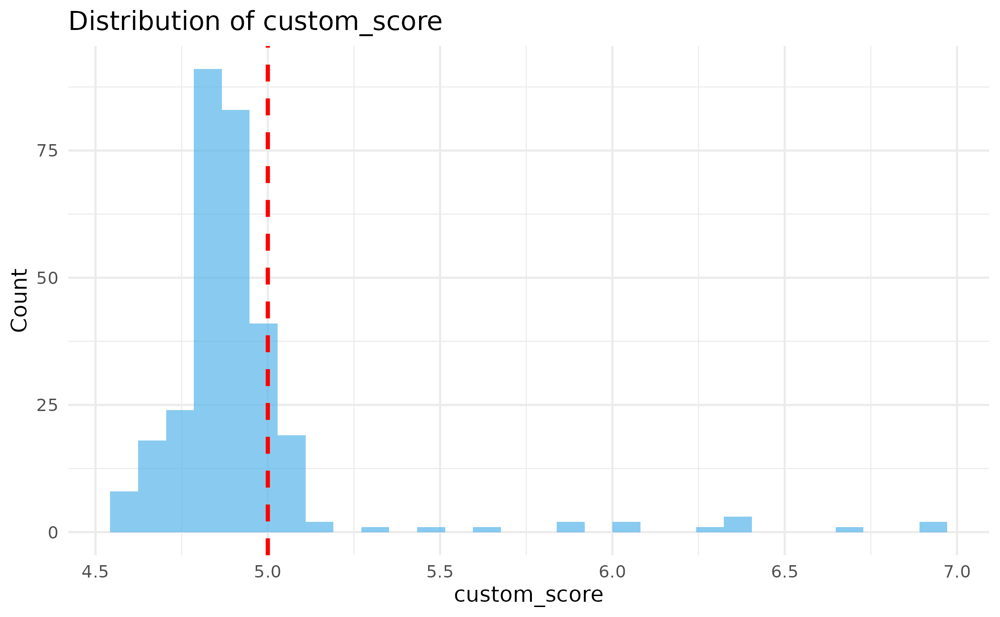
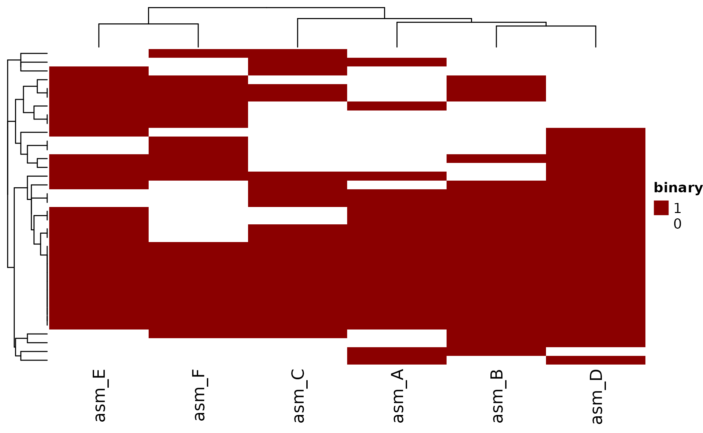
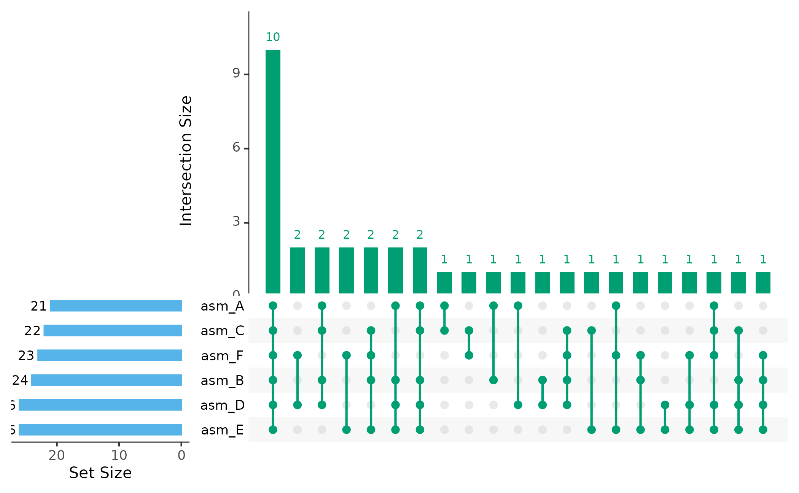
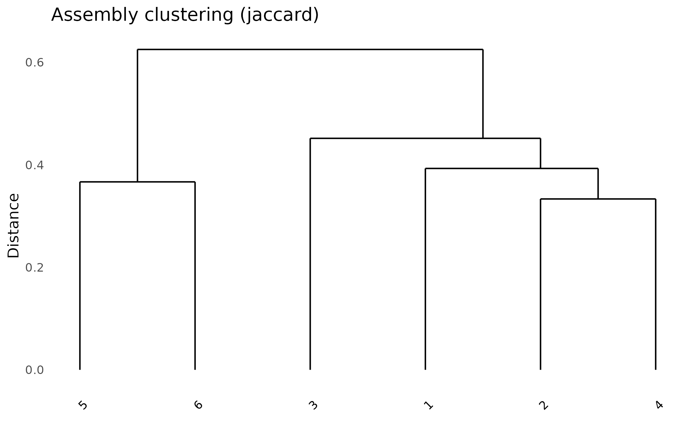

# Effector Analysis with paneffectR

## Introduction

This vignette demonstrates how to use paneffectR with output from the
[omnieff](https://github.com/TeamMacLean/omnieff) effector prediction
pipeline. The key advantage is the ability to **filter by effector
prediction scores**, focusing your analysis on high-confidence effector
candidates.

## The omnieff Pipeline

omnieff runs multiple effector prediction tools and combines their
results:

- **Signal peptide predictors**: SignalP 3/4/5/6, Phobius
- **Effector predictors**: EffectorP 1/2/3, DeepRedEff
- **Localization**: ApoplastP, Localizer
- **Domain annotations**: Pfam

The output includes:

1.  **FASTA files** (`*_reformatted.faa`): Protein sequences with
    standardized names
2.  **Score files** (`*_scored.csv`): All prediction scores plus a
    combined `custom_score`
3.  **Name mapping** (`*_name_mapping.csv`): Links new names to original
    contig names

## Setup

``` r
library(paneffectR)
library(dplyr)
#> 
#> Attaching package: 'dplyr'
#> The following objects are masked from 'package:stats':
#> 
#>     filter, lag
#> The following objects are masked from 'package:base':
#> 
#>     intersect, setdiff, setequal, union
```

## Loading omnieff Output

Use
[`load_proteins()`](https://TeamMacLean.github.io/paneffectR/reference/load_proteins.md)
with both FASTA and score directories:

``` r
# Get path to test data (simulates omnieff output structure)
testdata_dir <- system.file("testdata", package = "paneffectR")

# Load with scores
proteins <- load_proteins(
  fasta_dir = testdata_dir,
  score_dir = testdata_dir,
  pattern = "*.faa"
)
proteins
#> -- protein_collection --
#> 3 assemblies, 300 total proteins
#> 
#> # A tibble: 3 × 3
#>   assembly_name n_proteins has_scores
#>   <chr>              <int> <lgl>     
#> 1 assembly1            100 TRUE      
#> 2 assembly2            100 TRUE      
#> 3 assembly3            100 TRUE
```

Notice that `has_scores` is TRUE for all assemblies.

## Understanding Score Columns

The score data contains many columns from different prediction tools:

``` r
# Get one assembly to explore
ps <- proteins$assemblies[["assembly1"]]

# All available columns
names(ps$proteins)
#>  [1] "protein_id"                       "sequence"                        
#>  [3] "assembly"                         "signalp3_nn"                     
#>  [5] "signalp3_nn_d"                    "signalp3_hmm"                    
#>  [7] "signalp3_hmm_s"                   "signalp4"                        
#>  [9] "signalp4_d"                       "signalp5"                        
#> [11] "signalp5_d"                       "signalp5_prediction"             
#> [13] "phobius_tm_count"                 "phobius_has_sp"                  
#> [15] "phobius_prediction"               "effectorp1"                      
#> [17] "effectorp1_prob"                  "effectorp2"                      
#> [19] "effectorp2_prob"                  "effectorp3_cytoplasmic_fungal"   
#> [21] "effectorp3_apoplastic_fungal"     "effectorp3_noneffector_fungal"   
#> [23] "effectorp3_prediction_fungal"     "effectorp3_cytoplasmic_nonfungal"
#> [25] "effectorp3_apoplastic_nonfungal"  "effectorp3_noneffector_nonfungal"
#> [27] "effectorp3_prediction_nonfungal"  "deepredeff_fungi"                
#> [29] "deepredeff_oomycete"              "apoplastp"                       
#> [31] "apoplastp_prediction"             "tmhmm_tm_count"                  
#> [33] "tmhmm_prediction"                 "localizer"                       
#> [35] "pfam_ids"                         "pfam_names"                      
#> [37] "pfam_best_evalues"                "has_selected_pfam_match"         
#> [39] "signalp6"                         "signalp6_d"                      
#> [41] "signalp6_prediction"              "custom_score"                    
#> [43] "score_rank"
```

### Key Score Columns

| Column                         | Description                                             |
|--------------------------------|---------------------------------------------------------|
| `custom_score`                 | Combined effector score (higher = more likely effector) |
| `score_rank`                   | Rank by custom_score (1 = highest)                      |
| `effectorp1_prob`              | EffectorP v1 probability                                |
| `effectorp2_prob`              | EffectorP v2 probability                                |
| `effectorp3_prediction_fungal` | EffectorP v3 category (fungal mode)                     |
| `deepredeff_fungi`             | DeepRedEff fungal score                                 |
| `signalp5_d`                   | SignalP5 D-score                                        |

### Exploring Score Distributions

``` r
# Top-scoring proteins in assembly1
ps$proteins %>%
  arrange(score_rank) %>%
  select(protein_id, custom_score, score_rank,
         effectorp2_prob, signalp5_d) %>%
  head(10)
#> # A tibble: 10 × 5
#>    protein_id       custom_score score_rank effectorp2_prob signalp5_d
#>    <chr>                   <dbl>      <int>           <dbl>      <dbl>
#>  1 assembly1_000267         5.92          1           0.764    0.0623 
#>  2 assembly1_003502         5.14          2           0.613    0.352  
#>  3 assembly1_001347         5.06          3           0.996    0.181  
#>  4 assembly1_005840         5.06          4           0.995    0.446  
#>  5 assembly1_006291         5.00          5           0.999    0.00965
#>  6 assembly1_004421         4.99          6           0.982    0.0759 
#>  7 assembly1_001504         4.99          7           0.979    0.829  
#>  8 assembly1_002717         4.95          8           0.974    0.0398 
#>  9 assembly1_002883         4.93          9           0.969    0.0293 
#> 10 assembly1_004234         4.91         10           0.998    0.182
```

## Visualizing Score Distributions

Before filtering, understand your score distributions:

``` r
# Overall distribution
plot_scores(proteins)
```



``` r

# By assembly
plot_scores(proteins, by_assembly = TRUE)
```



### Choosing a Threshold

The `custom_score` combines multiple predictors. Higher scores indicate
stronger effector evidence. Use a threshold to focus on high-confidence
candidates:

``` r
# Show threshold line at score = 5
plot_scores(proteins, threshold = 5.0)
```


``` r

# Histogram view
plot_scores(proteins, plot_type = "histogram", threshold = 5.0)
```



## Clustering and Filtering

### Basic Clustering

``` r
# Cluster all proteins (requires DIAMOND)
clusters <- cluster_proteins(proteins, method = "diamond_rbh")
```

For this vignette, we’ll use pre-computed clusters:

``` r
visual_dir <- system.file("testdata", "visual", package = "paneffectR")
clusters <- readRDS(file.path(visual_dir, "clusters_visual.rds"))
```

### Building a Filtered Matrix

Filter to only high-confidence effectors when building the matrix:

``` r
# Load the proteins that match the clusters
proteins_visual <- readRDS(file.path(visual_dir, "proteins_visual.rds"))

# Build matrix with score threshold
# Only orthogroups containing proteins with score >= 3 are included
pa_filtered <- build_pa_matrix(
  clusters,
  type = "binary",
  score_threshold = 3.0,
  proteins = proteins_visual
)
pa_filtered
#> -- pa_matrix (binary) --
#> 36 orthogroups x 6 assemblies
#> Sparsity: 34.3%
#> Threshold: 3
```

Compare with unfiltered:

``` r
pa_all <- build_pa_matrix(clusters, type = "binary")

cat("All orthogroups:", nrow(pa_all$matrix), "\n")
#> All orthogroups: 50
cat("After score filter:", nrow(pa_filtered$matrix), "\n")
#> After score filter: 36
```

## Score-Based Matrix

Instead of binary presence/absence, you can create a matrix with actual
scores:

``` r
# Use maximum score per orthogroup per assembly
pa_score <- build_pa_matrix(
  clusters,
  type = "score",
  score_column = "custom_score",
  proteins = proteins_visual
)

# View scores (0 = absent, otherwise the score value)
pa_score$matrix[1:5, ]
#>              asm_A    asm_B    asm_C    asm_D    asm_E    asm_F
#> OG_acc_01 6.329748       NA       NA       NA 5.634757 4.490995
#> OG_acc_02 4.880568 4.297836       NA 6.800552 6.062126       NA
#> OG_acc_03 5.043444 4.251004 6.456519 5.171333 6.114216       NA
#> OG_acc_04 5.947353 6.840645 6.917769 4.371568       NA       NA
#> OG_acc_05 6.531186       NA 4.749513 5.804187 6.686394 5.975107
```

This is useful when you want to see not just presence/absence, but how
strongly each orthogroup is predicted as an effector in each assembly.

## Visualizing Effector Repertoires

### Heatmap with Score Colors

``` r
# Binary heatmap (presence/absence)
ht <- plot_heatmap(
  pa_filtered,
  cluster_rows = TRUE,
  cluster_cols = TRUE,
  show_row_names = FALSE,
  color = c("white", "darkred")
)
ComplexHeatmap::draw(ht)
```



### UpSet Plot for Effector Sharing

Which effectors are shared vs unique?

``` r
plot_upset(pa_filtered, min_size = 1)
#> Warning: `aes_string()` was deprecated in ggplot2 3.0.0.
#> ℹ Please use tidy evaluation idioms with `aes()`.
#> ℹ See also `vignette("ggplot2-in-packages")` for more information.
#> ℹ The deprecated feature was likely used in the UpSetR package.
#>   Please report the issue to the authors.
#> This warning is displayed once per session.
#> Call `lifecycle::last_lifecycle_warnings()` to see where this warning was
#> generated.
#> Warning: Using `size` aesthetic for lines was deprecated in ggplot2 3.4.0.
#> ℹ Please use `linewidth` instead.
#> ℹ The deprecated feature was likely used in the UpSetR package.
#>   Please report the issue to the authors.
#> This warning is displayed once per session.
#> Call `lifecycle::last_lifecycle_warnings()` to see where this warning was
#> generated.
#> Warning: The `size` argument of `element_line()` is deprecated as of ggplot2 3.4.0.
#> ℹ Please use the `linewidth` argument instead.
#> ℹ The deprecated feature was likely used in the UpSetR package.
#>   Please report the issue to the authors.
#> This warning is displayed once per session.
#> Call `lifecycle::last_lifecycle_warnings()` to see where this warning was
#> generated.
```



### Assembly Similarity

How similar are the effector repertoires between assemblies?

``` r
plot_dendro(pa_filtered, distance_method = "jaccard")
```



## Identifying Core vs Accessory Effectors

### Core Effectors

Present in all assemblies - likely essential for pathogenicity:

``` r
# Find orthogroups present in all assemblies
n_assemblies <- ncol(pa_filtered$matrix)
presence_count <- rowSums(pa_filtered$matrix)
core_og <- names(presence_count[presence_count == n_assemblies])

cat("Core effector orthogroups:", length(core_og), "\n")
#> Core effector orthogroups: 10
cat("Names:", paste(core_og, collapse = ", "), "\n")
#> Names: OG_core_01, OG_core_02, OG_core_03, OG_core_04, OG_core_05, OG_core_06, OG_core_07, OG_core_08, OG_core_09, OG_core_10
```

### Accessory Effectors

Present in some but not all assemblies:

``` r
accessory_og <- names(presence_count[presence_count > 1 & presence_count < n_assemblies])
cat("Accessory effector orthogroups:", length(accessory_og), "\n")
#> Accessory effector orthogroups: 26
```

### Unique Effectors (Singletons)

Present in only one assembly - may contribute to host specificity:

``` r
unique_og <- names(presence_count[presence_count == 1])
cat("Unique effector orthogroups:", length(unique_og), "\n")
#> Unique effector orthogroups: 0

# Which assemblies have them?
unique_assemblies <- apply(pa_filtered$matrix[unique_og, , drop = FALSE], 1, function(x) {
  names(x)[x == 1]
})
table(unlist(unique_assemblies))
#> < table of extent 0 >
```

## Exporting Results

### Export to CSV

``` r
# Export presence/absence matrix
write.csv(
  as.data.frame(pa_filtered),
  "effector_presence_absence.csv"
)

# Export orthogroup membership
write.csv(
  clusters$orthogroups,
  "orthogroup_membership.csv",
  row.names = FALSE
)
```

### Get Proteins from Specific Orthogroups

``` r
# Get proteins from core orthogroups
core_proteins <- clusters$orthogroups %>%
  filter(orthogroup_id %in% core_og)

head(core_proteins)
#> # A tibble: 6 × 3
#>   orthogroup_id assembly protein_id
#>   <chr>         <chr>    <chr>     
#> 1 OG_core_01    asm_A    asm_A_p001
#> 2 OG_core_01    asm_B    asm_B_p002
#> 3 OG_core_01    asm_C    asm_C_p003
#> 4 OG_core_01    asm_D    asm_D_p004
#> 5 OG_core_01    asm_E    asm_E_p005
#> 6 OG_core_01    asm_F    asm_F_p006
```

## Summary

Key steps for effector analysis:

1.  Load omnieff output with `load_proteins(fasta_dir, score_dir)`
2.  Explore scores with
    [`plot_scores()`](https://TeamMacLean.github.io/paneffectR/reference/plot_scores.md)
3.  Cluster with
    [`cluster_proteins()`](https://TeamMacLean.github.io/paneffectR/reference/cluster_proteins.md)
4.  Filter by score in `build_pa_matrix(score_threshold = ...)`
5.  Visualize with
    [`plot_heatmap()`](https://TeamMacLean.github.io/paneffectR/reference/plot_heatmap.md),
    [`plot_upset()`](https://TeamMacLean.github.io/paneffectR/reference/plot_upset.md),
    [`plot_dendro()`](https://TeamMacLean.github.io/paneffectR/reference/plot_dendro.md)
6.  Identify core/accessory/unique effectors

## Next Steps

- **[Getting
  Started](https://TeamMacLean.github.io/paneffectR/articles/getting-started.md)** -
  Basic workflow overview
- **[Pan-Genome
  Analysis](https://TeamMacLean.github.io/paneffectR/articles/pan-genome.md)** -
  Analysis without scores
- **[Algorithm Deep
  Dive](https://TeamMacLean.github.io/paneffectR/articles/algorithms.md)** -
  Technical details on clustering
